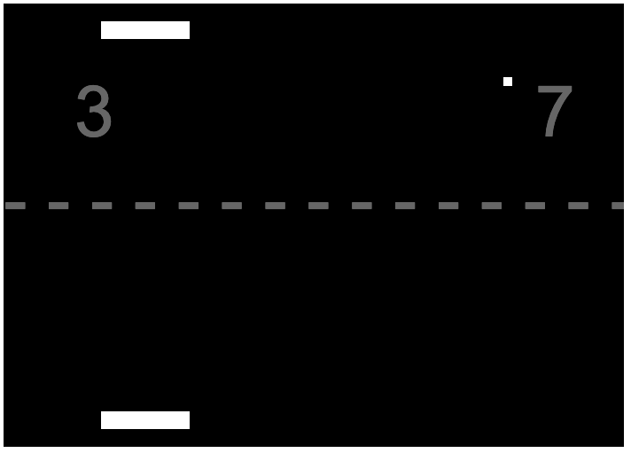
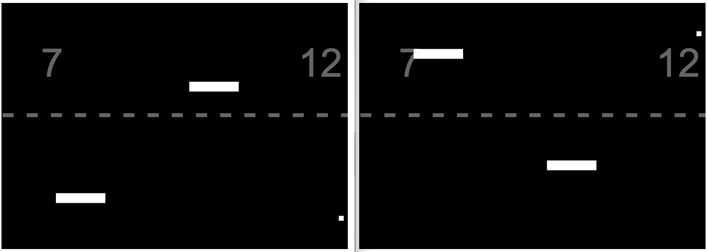

# Pong-Multiplayer
Client Server pong game using vanila JS, socket.IO, Express.IO

To start the server: npm run serve

The open 2 windows and play with your friend.

You can move the tile left, right, up and down.

The goal of this game is not to let the ball hit the bottom of your board.

